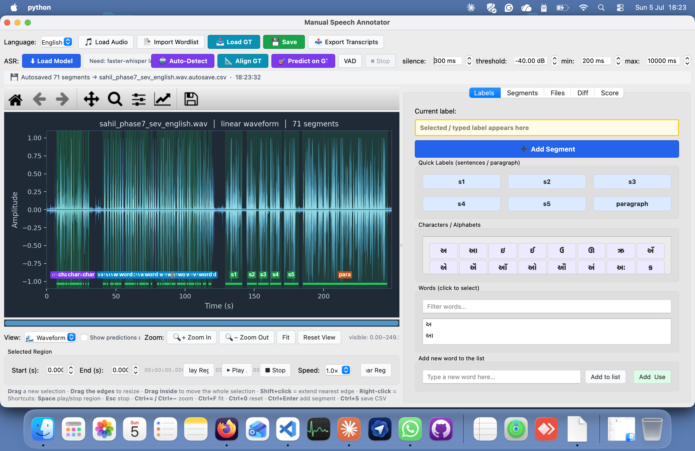

# Manual Speech Annotator

A desktop tool for building ground-truth speech-annotation datasets for **low-resource Indic languages** (Gujarati, Hindi, Marathi) and **English**. It combines manual region marking with ASR-assisted pre-labeling, forced alignment, multi-view audio visualization, and paper-grade quality metrics.

Built for read-speech corpora where a speaker reads scripted material (alphabets → words → sentences → paragraph). The tool measures itself: acceptance rate, WER, CER, boundary IoU, per-task-type breakdown, and per-segment timing — everything an evaluation table needs.

---

## Table of contents

- [What it does](#what-it-does)
- [Screenshots](#screenshots)
- [Installation](#installation)
- [Quick start](#quick-start)
- [Feature tour](#feature-tour)
- [Data layout](#data-layout)
- [Output formats](#output-formats)
- [Known limitations](#known-limitations)
- [Roadmap](#roadmap)
- [Repo layout](#repo-layout)
- [Citation](#citation)
- [License](#license)

---

## What it does

Three roles in one tool:

1. **Manual annotator** — draw regions on a waveform, assign labels, save. Standard Audacity-style interaction.
2. **ASR assistant** — VAD detects speech regions, an ASR model transcribes each, and the results are pre-filled as labels so the human verifies rather than types from scratch. Three ASR modes:
   - **🤖 Auto-Detect** — VAD + ASR + optional snap to a known vocabulary (from your transcripts, wordlist, or a pasted list).
   - **📐 Align GT to Audio** — you have the expected label sequence, the tool finds where each label occurs.
   - **🎯 Predict on GT** — you already have gold segments; the tool runs ASR on each and scores the model against your labels.
3. **Quality reporter** — computes acceptance rate, WER, CER, boundary IoU, and timing metrics; exports a paper-ready report and a JSONL training manifest.

### Supported languages

| Language | ASR backend | Notes |
|---|---|---|
| English | `faster-whisper large-v3` (preferred) or HF Whisper | Real word-level timestamps |
| Hindi | `ai4bharat/indic-conformer-600m-multilingual` | CTC; word timestamps estimated |
| Gujarati | Same IndicConformer | Same |
| Marathi | Same IndicConformer | Same |

Adding another language is straightforward if a Whisper- or CTC-compatible model exists for it.

---

## Screenshots



---

## Installation

Requires **Python 3.9+**.

```bash
git clone https://github.com/<you>/annotator.git
cd annotator

# Core dependencies
pip install PyQt5 matplotlib numpy scipy sounddevice soundfile

# ASR backends — install ONE or BOTH
pip install faster-whisper                     # English (fast, real word timestamps)
pip install torch transformers                 # Indic (IndicConformer) + English fallback

# Optional but recommended
pip install openpyxl python-docx pypdf librosa  # xlsx / docx / pdf loading
```

Missing optional dependencies degrade features gracefully rather than crash — the tool probes for each at startup and disables the associated feature if it's missing.

### System notes

- **Audio playback** uses `sounddevice`, which needs system PortAudio (`brew install portaudio` on macOS, `apt install libportaudio2` on Debian/Ubuntu).
- **First run downloads the ASR model** (~600 MB for IndicConformer, ~1.5 GB for Whisper large-v3). Cached to `~/.cache/huggingface`.
- **GPU is optional but faster.** With CUDA available, faster-whisper and IndicConformer both auto-use it.

---

## Quick start

```bash
python annotator.py
```

1. Pick a language from the dropdown → the matching wordlist and reference transcripts load automatically.
2. **Load .wav** — select your audio file.
3. **⬇ Load Model** — downloads/loads the model for the current language (one-time per model per session).
4. Choose your workflow:

   **From-scratch labeling** (unscripted audio, or first pass):
   > **🤖 Auto-Detect** → pick "Free-form" from the vocabulary picker → review the resulting segments.

   **Scripted material with known labels**:
   > **🤖 Auto-Detect** → pick "Use loaded wordlist" or "Use transcripts/{iso}.txt" from the picker → tool snaps each chunk's prediction to the closest vocab entry.

   **Scoring existing GT**:
   > **📥 Load GT** (accepts CSV/TSV/XLSX in `label, start, end` format) → **🎯 Predict on GT** → the model runs on every GT segment and shows timing + text errors.

5. Review on the waveform — type tags on each segment (`char`, `word`, `s1`, `p2 (45%)`), green GT badges, blue PRED badges, pink predicted-timing brackets with Δstart/Δend labels, red ⚠ markers on possible chunk-merges.

6. **💾 Save** to `.xlsx` or `.csv`. Optionally export a metrics report (📄) or JSONL manifest (📦) from the Score tab.

---

## Feature tour

### Waveform view

Audacity-style dark rendering with peak + RMS envelope, re-computed for the visible window so detail emerges on zoom. Five view modes: linear waveform, waveform in dB (−60 dB floor), linear spectrogram, log-dB spectrogram, and 80-band mel spectrogram. Variable-speed playback 0.25×–2×. A live cursor sweeps during playback.

### Region interaction

Drag to create a selection; drag edges to resize; drag inside to move; Shift-click extends the nearer edge; right-click sets the end; scroll wheel zooms around the cursor. Keyboard shortcuts:

| Key | Action |
|---|---|
| `Space` | Play/stop |
| `Esc` | Stop playback |
| `Ctrl+=` / `Ctrl+-` | Zoom in/out |
| `Ctrl+F` | Fit to window |
| `Ctrl+0` | Reset view |
| `Ctrl+Enter` | Add segment from region |
| `Ctrl+S` | Save |
| `Ctrl+Z` / `Ctrl+Shift+Z` | Undo / redo |
| `Ctrl+Y` | Redo (alt) |
| `Ctrl+Backspace` | Delete selected segment |

### Segment type classification

Every segment is auto-typed as **char / word / sentence / paragraph** based on its label:

- Single characters → `char` (purple tag)
- Single tokens → `word` (blue tag)
- `s1`–`s5` → `sentence` (green tag)
- `p1`–`p3` or >25 words → `paragraph` (orange tag)

This drives per-task-type metrics and color-coded tags on every segment bar.

### Snap-to-vocabulary (Auto-Detect)

When you have scripted material, snap-to-vocab replaces free-form ASR labels with canonical ones. Given the vocabulary `[apple, elephant, banana]`, the model's `"appal"` becomes `apple` (similarity 0.60). Snap threshold defaults to 0.55; below that the raw prediction is preserved so you can see when the model heard something the vocab doesn't cover.

**Merge-warning safeguard.** When VAD lumps several rapidly-read items into one chunk (e.g., alphabet recitation), the tool detects that the model's prediction contains multiple vocabulary items and flags the segment with ⚠ — telling you which specific labels are likely missing and offering fixes (tune VAD, or split the chunk manually).

### Partial-utterance detection

When Predict-on-GT runs on a paragraph segment, the tool measures how far into the reference paragraph the speaker got. If the model transcribed `"garba is the folk dance of gujarat, it is an integral part of navratri"` against a 25-word reference, the tool reports `⚠ partial: 14/25 words (56%)` and tags the segment `para (56%)`.

Robust to ASR errors — fuzzy word matching lets `"garbaa"` match `"Garba"` and `"gujrat"` match `"Gujarat"` without breaking the count.

### Split detection

Complementary problem: sometimes one *reference* paragraph gets spread across *multiple* audio chunks (speaker paused at sentence boundaries). The 🧩 **Detect Splits** button finds consecutive segments whose predictions together cover the reference in reading order and offers to relabel them `p1`, `p2`, `p3` — with each new segment carrying the actual text portion it covered. Similar treatment for sentence splits (`s2` → `s2a`, `s2b`).

Full comparison of old vs new behavior in [`docs/split_detection_comparison.pdf`](docs/split_detection_comparison.pdf).

### Analytics dashboard (Score tab)

`compute_metrics()` produces global and per-task-type breakdowns of:

- **Acceptance rate** — % of model predictions kept verbatim
- **WER** — word error rate (uses resolved reference text for sequence-ID labels like `s1`)
- **CER** — character error rate (more honest than WER for isolated chars and Indic)
- **Boundary IoU** — median + mean, plus `%IoU ≥ 0.5` and `%IoU ≥ 0.8`
- **Timing MAE** — mean absolute start/end error
- **Time per segment** — mean + median from the silent per-segment timing log

Per-task-type breakdown table is designed to be paste-ready for a paper's evaluation section.

### Autosave and undo

- Autosave to `annotations/.autosave/<name>.autosave.csv` every 30 s and after edits. On next load, offers to restore.
- 60-state undo/redo ring buffer covering every add/delete/relabel/retime.

### Multi-file project mode

Open a folder from the Files tab. Status icons show which files are unprocessed / in-progress / saved. Jump to the next unfinished file with one click.

---

## Data layout

The tool reads and writes from a specific folder structure alongside `annotator.py`:

```
annotator.py
wordlists/          gu.txt  hi.txt  mr.txt  en.txt      # one label per line
transcripts/        gu.txt  hi.txt  mr.txt  en.txt      # [s1]..[s5] + [paragraph] reference
annotations/        <name>.xlsx / <name>.csv            # saved outputs
annotations/.autosave/  <name>.autosave.csv             # crash-recovery snapshots
```

`transcripts/<iso>.txt` is shared with a companion segmentation tool (`app.py`), so reference sentences and paragraphs stay in sync between the two tools. Loading a `.docx` or `.pdf` via **Import Wordlist** populates chars, words, sentences, and paragraph in memory for the current session; `transcripts/<iso>.txt`, if present, overrides the parsed sentences and paragraph (it's the curated reference).

---

## Output formats

### Annotations CSV / XLSX

Columns: `label`, `start`, `end`, `prediction` (optional). Times written as `HH:MM:SS.fff`. XLSX includes a header row; CSV is headerless for direct downstream consumption. On load, header-column synonyms are accepted (`Content`, `Word`, `Text`, `Transcript` all map to `label`) and times parse from `HH:MM:SS.fff`, `MM:SS`, or plain seconds.

### JSONL training manifest

One record per segment, ready for NeMo / ESPnet / HuggingFace ASR fine-tuning:

```json
{
  "audio_filepath": "/path/to/Female.wav",
  "offset": 6.500,
  "duration": 2.500,
  "start": 6.500,
  "end": 9.000,
  "text": "s1",
  "prediction": "the cat sat on the mat",
  "type": "sentence",
  "language": "en"
}
```

Partial-paragraph and split-detection fields (`para_fraction`, `_split_ref_text`, etc.) are included when present.

### Metrics report

Plain-text report from the Score tab — paste-ready for a paper's evaluation section. Includes global metrics and the per-task-type breakdown table.

---

## Known limitations

Being honest about these matters — both for users and for anyone reviewing the paper. In no particular order:

- **Many-to-one alignment is written but not wired in.** The current forced-alignment path (`align_labels_to_chunks`) is strictly one-chunk-to-one-label. When a speaker reads a row of alphabets rapidly, VAD merges them into one chunk and most labels are reported unmatched. A `align_labels_grouped()` function that allows many labels per chunk (with time-span sub-splitting) exists in the source but has not yet been swapped into `AlignThread.run`. Interim workaround: tune VAD to make each rapid item its own chunk (lower `silence_ms`, raise threshold).
- **IndicConformer word timestamps are estimated**, not real. faster-whisper reports true word-level timing (`word_timestamps=True`); IndicConformer only reports one text-per-clip, so the tool splits the clip duration evenly across the predicted words. This is flagged as `(est.)` in the timing-error display.
- **Desktop-only**, not web-based. Every annotator needs Python + PyQt + torch + a model download. Fine for a small team; harder for a distributed one. See [Roadmap](#roadmap).
- **No real-time collaboration.** Single-machine, single-annotator per session. Multiple annotators produce separate files that can be compared post-hoc but not merged live.
- **Inter-annotator agreement not built in.** You can export each annotator's file and compute boundary-IoU / label-agreement externally, but the tool doesn't yet load two annotators' files and compute IAA in-app.
- **VAD is energy-based**, not neural. Fast and predictable, but fails on very quiet speech, mumbled endings, or high background noise. Neural VAD (Silero, WebRTC) would help but adds dependencies.

---

## Roadmap

Roughly in priority order:

- [ ] Wire `align_labels_grouped()` into `AlignThread` so rapid-reading recordings stop losing labels
- [ ] Inter-annotator agreement: load a second annotator's file, compute boundary IoU + label κ
- [ ] Partial-utterance detection benchmark: eval set + precision/recall/F1 numbers
- [ ] Web version: FastAPI backend + React/WaveSurfer.js frontend for multi-annotator use
- [ ] Neural VAD option (Silero) alongside the energy-based one
- [ ] Active-learning triage: sort segments by model uncertainty for review prioritization
- [ ] Live per-speaker error-pattern surfacing (e.g. "IndicConformer confuses ट/त on this speaker")

---

## Repo layout

```
annotator.py                        # the entire application (~6100 lines)
README.md
docs/
  ANNOTATOR_DOCUMENTATION.md        # in-depth technical documentation
  split_detection_comparison.pdf    # old vs new split-detection behavior
wordlists/                          # per-language expected labels
  gu.txt hi.txt mr.txt en.txt
transcripts/                        # per-language reference sentences + paragraph
  gu.txt hi.txt mr.txt en.txt
annotations/                        # your saved output goes here
```

The single-file architecture is deliberate: fewer moving parts, easier to distribute to non-technical annotators, no import path issues. See `docs/ANNOTATOR_DOCUMENTATION.md` for the internal structure (module-level helpers, four `QThread` classes, one big `MainWindow`).

---

## Citation

If you use this tool in a publication, please cite:

```bibtex
@software{annotator2025,
  title = {Manual Speech Annotator: an ASR-assisted annotation tool for
           low-resource Indic and English read-speech corpora},
  author = {<your name here>},
  year = {2025},
  url = {https://github.com/<you>/annotator}
}
```

*(Replace with your actual citation once the paper is out; keeping this stub here reminds you to update it.)*

---

## License

*(Add your license of choice. MIT and Apache-2.0 are common for research tools. Include a `LICENSE` file at repo root.)*

---

## Acknowledgments

- **AI4Bharat / IIT Madras** for the IndicConformer model (`ai4bharat/indic-conformer-600m-multilingual`)
- **OpenAI** for Whisper and **Systran** for faster-whisper
- Reference text material courtesy of Dr. Abhishek (used for controlled read-speech recordings)
